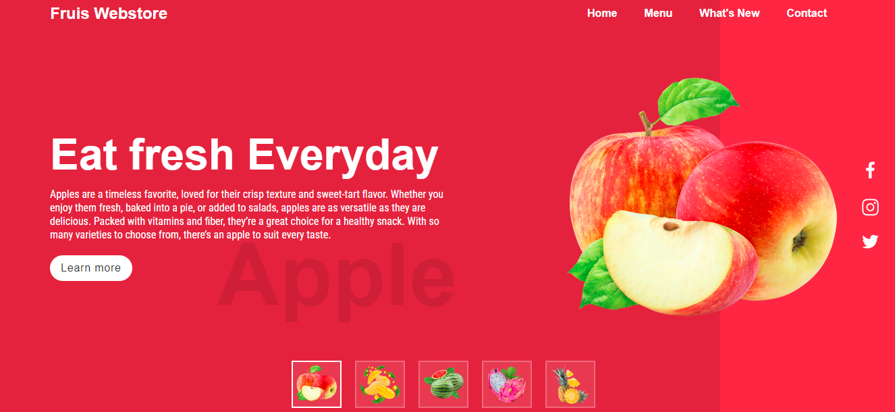
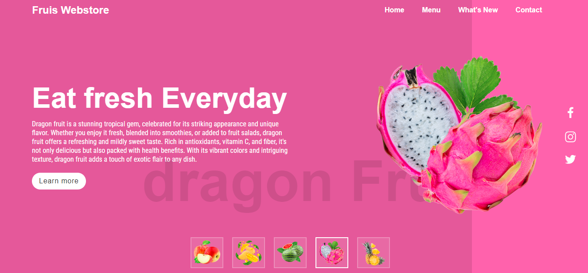

# 🍓 Amazing Fruit Webpage 🍍

## Welcome to My Fruit Showcase!

This project is a vibrant and beautifully designed webpage dedicated to showcasing a variety of fresh and exotic fruits. It highlights my web development skills with a visually appealing layout, engaging content, and seamless navigation.

### Features:

- **Eye-catching Design**: A colorful and dynamic interface that captures the essence of each fruit.
- **Responsive Layout**: Optimized for all devices, ensuring a great user experience on desktops, tablets, and smartphones.
- **Informative Content**: Each fruit is accompanied by interesting facts and nutritional information.
- **Interactive Elements**: Hover effects, animations, and smooth transitions enhance the user experience.

### Technologies Used:

- **HTML5**: For the structure and content of the webpage.
- **CSS3**: For styling, including Flexbox and Grid for layout, and animations for interactivity.
- **JavaScript**: For dynamic content and interactive elements.

### Live Demo

Check out the live demo of the fruit showcase webpage [here](https://farhansahibzada.github.io/Fruit-webpage/).

### Contact

For any questions or feedback, feel free to reach out to me:

- **Name**: [Farhan Sahibzada]
- **Email**: [farhansahabzada3@gmail.com]
- **GitHub**: [https://github.com/Farhan Sahibzada](https://github.com/Farhan Sahibzada)

